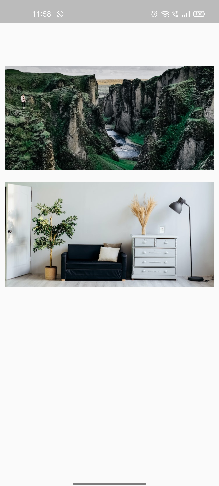

<!-- 
This README describes the package. If you publish this package to pub.dev,
this README's contents appear on the landing page for your package.

For information about how to write a good package README, see the guide for
[writing package pages](https://dart.dev/guides/libraries/writing-package-pages). 

For general information about developing packages, see the Dart guide for
[creating packages](https://dart.dev/guides/libraries/create-library-packages)
and the Flutter guide for
[developing packages and plugins](https://flutter.dev/developing-packages). 
-->
# Network Image Search

First Open Source Flutter based Beautiful Material Design Music Player(Online Radio will be added soon.)


## Features

* [x] Compatible on Android and iOS.

  * [x] Customizable width and height.
  * [x] Beautiful Network Images
  * [x] Name and Related Name parameter.
  * [x] Fully Responsive
  * [x] Free and No Watermark Images
  * [x] Loading indicator (Coming Soon)

### Show some :heart: and star the repo to support the project


### Screenshots

  



### Usage

[Example](https://github.com/darshn-n/Network-Image-Search/blob/master/example/example_app.dart)


### Created & Maintained By

[Darshan N](https://github.com/darshn-n) 

> If you found this project helpful or you learned something from the source code and want to thank me <darshan51081@gmail.com>

# License

    Copyright 2022 Darshan N

    Licensed under the Apache License, Version 2.0 (the "License");
    you may not use this file except in compliance with the License.
    You may obtain a copy of the License at


    Unless required by applicable law or agreed to in writing, software
    distributed under the License is distributed on an "AS IS" BASIS,
    WITHOUT WARRANTIES OR CONDITIONS OF ANY KIND, either express or implied.
    See the License for the specific language governing permissions and
    limitations under the License.

## Getting started


For help getting started with Flutter, view our online
[documentation](https://flutter.dev/).

## Usage

* To add the following dependency to your [pubspec.yaml](https://github.com/darshn-n/Network-Image-Search)

```yaml
    dependencies:
        flutter:
            sdk: flutter
        network_image_search:
```

```dart
return const Scaffold(
      body: Center(
        child: UnsplashImages(
          width: '720',
          name: 'bike',
          relatedName: 'cycle',
          height: '360',
        ),
      ),
    );
```

## Additional information

This package is Light-weight and it does not acquire any of the external or internal storage of your project. Completely Network based Images. 
